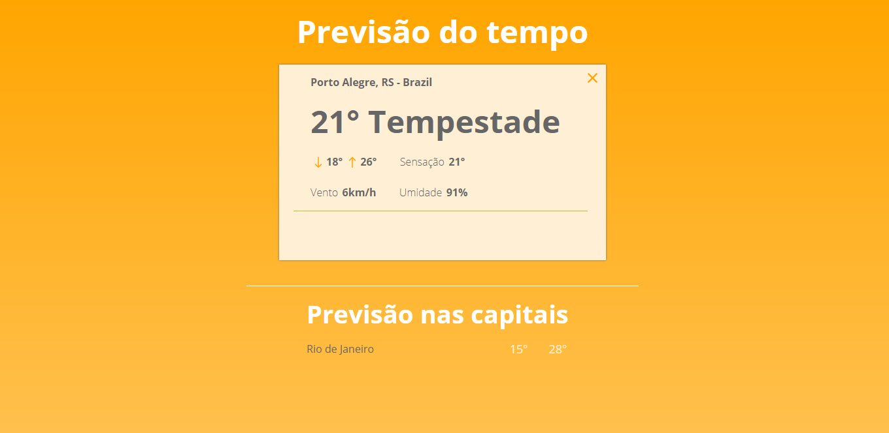

This project was bootstrapped with [Create React App](https://github.com/facebook/create-react-app).

# Previsão do tempo

## 1. Passos para começar

### - Clone o repositório

`git clone https://github.com/albrechthugo/weather-forecast.git`

### - Instale as dependências

`npm install || yarn install`

### - Crie uma chave para utilizar a API

- [Acesse esse link](https://developer.yahoo.com/weather/)
- Após criar as chaves, crie um arquivo chamado `keys.js` dentro da pasta `src`
- Nesse arquivo `keys.js`, cole o seguinte código:

---

const keys = { 
APP_ID: 'sua app id aqui', 
CONSUMER_KEY: 'sua consumer key aqui', 
CONSUMER_SECRET: 'sua consumer secret aqui' 
}

export default keys;

---

### - Inicie o servidor

`npm start || yarn start`

## 2. Sobre o projeto

Essa aplicação tem como objetivo principal aprimorar meus conhecimentos em ReactJS. A ideia do projeto foi retirada do repositório a seguir: <a href="https://github.com/felipefialho/frontend-challenges">felipefialho/frontend-challenges</a>, e foi um teste desenvolvido pela <a href="https://1sti.com.br">1STi</a>.

Os dados de clima são recebidos pela <a href="https://developer.yahoo.com/weather/">API</a> do Yahoo Developer.

## 3. Preview Desktop (aplicação em desenvolvimento)

## 4. Preview Mobile (aplicação em desenvolvimento)
